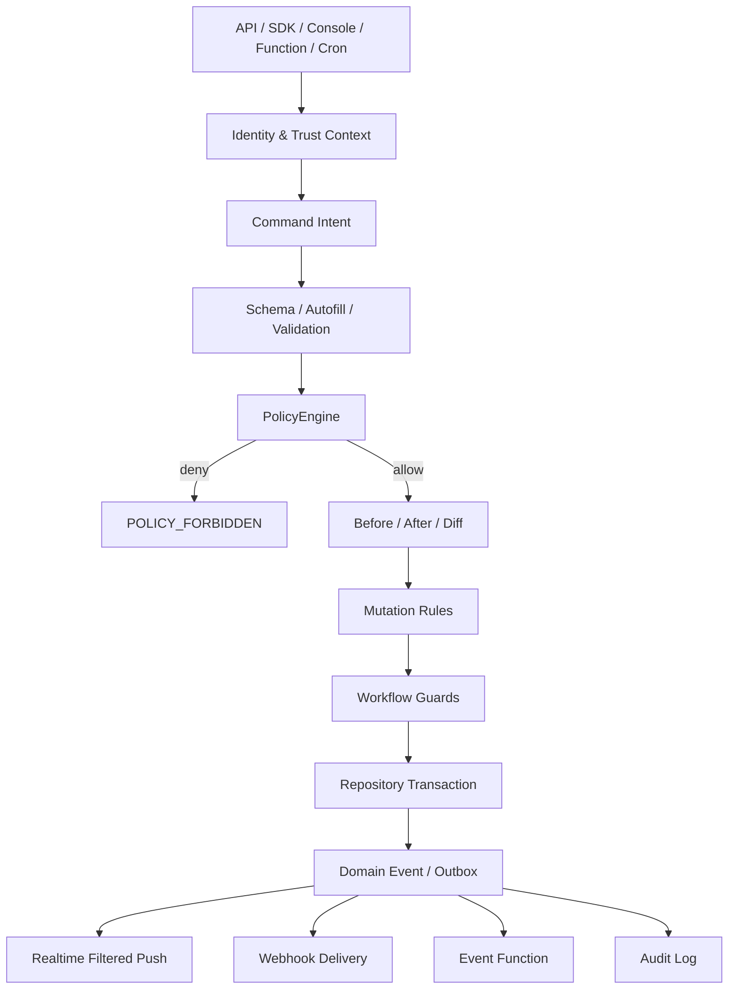

# 安全数据管理与业务流程分层

本文档定义 UniID 下一阶段的数据安全与业务流程分层。目标是把访问控制、数据结构、派生处理、业务状态、事件分发和审计拆清楚，避免把所有能力都塞进 Policy。

## 总体分层



## 层级职责

| 层 | 职责 | 不负责 |
|---|---|---|
| Schema | 数据结构、类型、autofill、基础校验 | 访问权限、业务副作用 |
| Policy | allow/deny、字段权限、动作权限、using/check | 派生字段、通知、外部调用 |
| Mutation Rule | 同记录派生字段、计数维护、差量处理 | 跨记录事务、外部 API |
| Workflow | 状态流转、业务动作、流程守卫 | 数据结构定义、Webhook 投递 |
| Function | 复杂业务逻辑、跨记录处理、外部系统集成 | 绕过安全边界 |
| Event / Outbox | 统一事件、重试、幂等、死信 | 权限决策 |
| Audit | 审计、explain、排障、合规追踪 | 业务执行 |

## Command Context

所有写入入口最终都应该被转换为统一 Command：

```txt
actor + intent + changeSet
```

`actor` 是身份上下文，来源可以是 SDK、控制台、API Key、Function、Cron 或系统任务。

`intent` 描述本次想做什么：

```txt
kind / appId / dataType / recordId / data / ops / transition / metadata
```

`changeSet` 描述数据变化：

```txt
before / submitted / after / changedPaths
```

协议类型定义在：

- `src/shared/business/types.ts`

## Policy 边界

Policy 只回答：

```txt
谁，能不能，对哪个资源，执行哪个动作，访问哪些字段。
```

适合放进 Policy：

- 用户只能读已发布文章。
- 作者可以编辑自己的草稿。
- 管理员可以发布文章。
- 用户只能设置自己的 `data.likes.{userId}`。
- Function `syncSearch` 可以读取指定字段。

不适合放进 Policy：

- 点赞后 `likeCount += 1`。
- 评论后 `commentCount += 1`。
- 发通知。
- 投递 Webhook。
- 同步搜索索引。
- 修改其它记录。

## Mutation Rule

Mutation Rule 处理“数据变化之后，同一条记录内应该自动发生什么变化”。

### 文章点赞

客户端只提交自己的点赞位：

```json
{
  "ops": [
    {
      "type": "set",
      "path": "data.likes.user_a",
      "value": { "likedAt": 1710000000 }
    }
  ]
}
```

Policy 限制用户只能改自己的点赞位：

```json
{
  "id": "user-can-like-self",
  "effect": "allow",
  "actions": ["set", "unset"],
  "subjects": ["$dynamic:likes.$user"],
  "resource": { "fields": ["data.likes.*"] },
  "using": null,
  "check": null
}
```

Mutation Rule 维护计数：

```json
{
  "version": 1,
  "id": "article-like-count-up",
  "dataType": "article",
  "on": ["data.likes.*.set"],
  "when": {
    "before.exists": false,
    "after.exists": true
  },
  "then": [
    { "type": "increment", "path": "data.likeCount", "by": 1 }
  ]
}
```

取消点赞：

```json
{
  "version": 1,
  "id": "article-like-count-down",
  "dataType": "article",
  "on": ["data.likes.*.unset"],
  "when": {
    "before.exists": true,
    "after.exists": false
  },
  "then": [
    { "type": "increment", "path": "data.likeCount", "by": -1 }
  ]
}
```

安全边界：普通用户不直接拥有 `data.likeCount` 的 `increment` 权限，计数只能由可信 Mutation Rule 维护。

## Workflow

Workflow 处理状态流转。

示例：文章发布流程。

```json
{
  "version": 1,
  "id": "article-publishing",
  "dataType": "article",
  "stateField": "data.status",
  "transitions": [
    {
      "id": "submit-review",
      "from": "draft",
      "to": "reviewing",
      "action": "submit",
      "subjects": ["$owner"]
    },
    {
      "id": "publish",
      "from": "reviewing",
      "to": "published",
      "action": "publish",
      "subjects": ["$app_admin"]
    }
  ]
}
```

Policy 和 Workflow 的关系：

```txt
Policy：这个人有没有权限执行 publish。
Workflow：当前状态能不能从 reviewing 变成 published。
```

运行时入口：

```txt
POST /api/v1/data/record/{recordId}/transition
POST /api/v1/apps/{appId}/data/{dataType}/records/{recordId}/transition
```

请求体：

```json
{
  "transition": "submit",
  "data": { "status": "reviewing" },
  "metadata": { "source": "editor" },
  "merge": true
}
```

也可以使用 `action` 字段表达同一语义：

```json
{
  "action": "publish",
  "data": { "publishedAt": 1710000000 }
}
```

`metadata` 进入 CommandContext，供 explain、审计和后续业务层使用，不会直接落到记录数据。状态字段的变更必须通过 transition/action 入口完成，普通 update 直接改状态字段会被 Workflow 拒绝。

## Function

Function 承载复杂逻辑：

- 跨记录事务。
- 外部 API。
- 支付回调。
- 搜索索引同步。
- AI/第三方服务。
- 复杂风控。

Function 调 Data API 时必须带上下文：

```txt
origin=function
functionName=<name>
requestId=<requestId>
eventId=<eventId>
```

Policy 可以使用 `$function:{name}` 授权可信函数执行特定动作。

## Event / Outbox

所有成功写入都应形成统一事件：

```txt
id / appId / type / resourceType / resourceId / actor / before / after / diff / requestId / createdAt
```

消费者：

- Realtime：按订阅者权限过滤 payload。
- Webhook：按事件和 filter 投递。
- Function trigger：按事件触发函数。
- Audit：记录关键动作和 explain 摘要。

事件源统一通过持久化 Outbox 发布。运行时启动后会挂载 Realtime、Audit、Webhooks 和 Function event trigger，并通过周期 worker 持续重放 pending/failed outbox；重放前会使用数据库短租约领取事件，失败超过上限后进入 dlq。这样 API 写入和异步消费使用同一份事件事实，不再出现“API 已过滤但 SSE 泄露”或“内存事件丢失后无法补偿”的双轨问题。

## Console

控制台的 `Business` 页面聚合两类业务文档：

- `Mutation Rules`：适合点赞计数、评论计数、同记录冗余字段维护。
- `Workflows`：适合文章发布、订单流转、审批状态机。

页面提供：

- 常见模板。
- app / dataType / record scope。
- JSON 高级编辑。
- Flow Simulator，用 CommandContext 预览当前文档的执行结果。

## 统一写入生命周期

```txt
1. 入口鉴权，生成 actor
2. 组装 Command
3. 加载 Schema 和 Policy
4. 计算 before / submitted / after / diff
5. Schema autofill 与基础校验
6. PolicyEngine 做行级和字段级判断
7. Mutation Rule 处理派生变更
8. Workflow 校验状态流转
9. 对最终数据二次 Schema 校验
10. Repository transaction 持久化
11. 写 Audit 和 Outbox
12. Realtime / Webhook / Function trigger 消费事件
```

## 后续实施顺序

1. 先让 `DataPipeline` 内部使用 Command / changeSet。
2. 再接入 Mutation Rule MVP，优先覆盖点赞计数。
3. 再接入 Workflow MVP，优先覆盖文章发布流程。
4. 最后引入持久化 Outbox，把 Realtime / Webhook / Function trigger / Audit 统一到事件消费模型。
